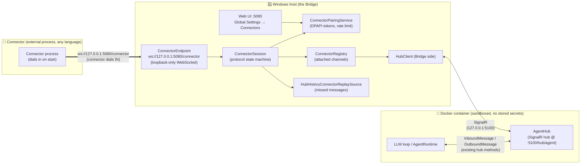
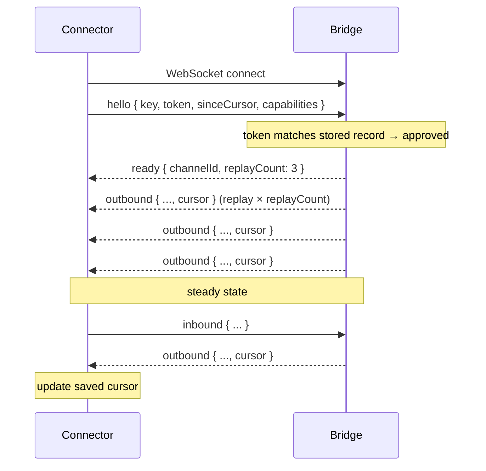

# Connector Plugin System

How third-party developers build Cortex **channels (connectors)** — in any language, out of tree,
with no fork — by connecting over a documented **WebSocket + JSON protocol**, getting approved once
through a pairing flow, and behaving like any first-party channel from that point on.

- Spec: [`docs/superpowers/specs/2026-08-07-connector-plugin-system-design.md`](superpowers/specs/2026-08-07-connector-plugin-system-design.md)
- Shipped: (unreleased)

## The one principle: the Bridge is the connector host *and* the credential boundary

The agent never sees a connector credential. It only ever sends and receives `InboundMessage` /
`OutboundMessage` over the existing `/hub/agent` SignalR connection — exactly as it does with every
first-party channel. The Bridge owns everything the container cannot safely do: accepting connector
sockets, pairing approval, DPAPI token storage, revocation, and rate limiting.

> **Direction note — this is the opposite of MCP:** MCP servers sit _on the host_ and the Bridge
> dials _out_ to them. Connectors are _external processes_ that dial _in_ to the Bridge. The agent
> is entirely unaware of either.

Connectors are never reached from inside the container. Only message content crosses the container
boundary — never a connector credential, socket, or address.

## Component / deployment view



## Protocol reference

Every message on the wire is a JSON object with exactly two top-level fields:

```json
{ "type": "<frame-type>", "payload": { ... } }
```

`payload` is always an object; for frames with no payload (e.g. `ping`) it is an empty object `{}`.
The serialiser uses **camelCase** field names and omits null fields.

### Frame type summary

| Frame | Direction | Purpose |
|---|---|---|
| `hello` | Connector → Bridge | Open the session; declare identity and capabilities |
| `inbound` | Connector → Bridge | Send a user message |
| `abort` | Connector → Bridge | Cancel an in-flight generation |
| `pong` | Connector → Bridge | Respond to a `ping` |
| `pairing_required` | Bridge → Connector | Pairing needed; includes code and expiry |
| `paired` | Bridge → Connector | Pairing approved; includes token and channel id |
| `pairing_denied` | Bridge → Connector | Pairing or auth denied; session closes after |
| `ready` | Bridge → Connector | Accepted; includes channel id and replay count |
| `typing` | Bridge → Connector | Agent is composing a reply |
| `stream` | Bridge → Connector | Streaming text delta |
| `outbound` | Bridge → Connector | Final agent response (also used for replay) |
| `error` | Bridge → Connector | Protocol or policy error |
| `ping` | Bridge → Connector | Liveness probe |

> **Fatal vs. recoverable:** a `pairing_denied` or any `error` that causes the Bridge to close the
> socket is fatal for that session. `rate_limited`, `invalid_payload`, and `message_too_long` are
> sent as error frames but the session remains open — the connector should back off and retry.
> See [Limits and error handling](#limits-and-error-handling) for the full table.

---

### `hello` (Connector → Bridge)

Sent as the **first frame** after connecting. Must arrive within **10 seconds** of the socket
being opened, or the Bridge sends `protocol_violation` and closes.

```json
{
  "type": "hello",
  "payload": {
    "key": "echo",
    "displayName": "Echo Connector",
    "version": "1.0.0",
    "instanceId": "default",
    "token": "dpapi:...",
    "sinceCursor": "2026-08-06T14:00:00.0000000Z",
    "capabilities": {
      "streaming": true,
      "richText": true,
      "media": false,
      "maxMessageLength": 100000
    }
  }
}
```

| Field | Type | Required? | Meaning |
|---|---|---|---|
| `key` | string | **Yes** | Connector type key. 1–64 chars, `[a-z0-9_-]`. Normalised to lowercase. |
| `displayName` | string | No | Human name shown in the Web UI. Defaults to `key`. Truncated at 256 chars. |
| `version` | string | No | Connector software version; informational only. |
| `instanceId` | string | No | Allows one `key` to serve multiple channels. Defaults to `"default"`. Same charset/length as `key`. |
| `token` | string | No | DPAPI token from a prior `paired` frame. Omit on first connect. |
| `sinceCursor` | string | No | ISO-8601 cursor for replay. **Omit (or absent/unparseable) → no replay.** |
| `capabilities` | object | No | See sub-fields below. |
| `capabilities.streaming` | bool | No | Set `true` to receive `stream` and `typing` frames. Default `false`. |
| `capabilities.richText` | bool | No | `true` if the connector renders Markdown. |
| `capabilities.media` | bool | No | Accepted but **not honoured in v1** — `SupportsMedia` is always `false`. |
| `capabilities.maxMessageLength` | int | No | Max chars the connector accepts. Clamped to [1, 100 000]. Default 100 000. |

The **channel id** is derived deterministically: `plugin:<key>:<instanceId>`.

---

### `inbound` (Connector → Bridge)

A user message from the connector's channel.

```json
{
  "type": "inbound",
  "payload": {
    "conversationId": "my-thread-42",
    "messageId": "msg-0001",
    "sender": {
      "id": "user-99",
      "displayName": "Alice"
    },
    "content": {
      "text": "Hello, Cortex!",
      "isMarkdown": false
    }
  }
}
```

| Field | Type | Required? | Meaning |
|---|---|---|---|
| `conversationId` | string | No | Identifies the thread. Max 128 chars. Defaults to the channel id. |
| `messageId` | string | No | Connector-assigned id. Max 128 chars. Auto-generated if absent. |
| `sender.id` | string | No | Sender identifier. Max 128 chars. Defaults to `"connector"`. |
| `sender.displayName` | string | No | Sender name. Truncated at 256 chars. |
| `content.text` | string | **Yes** | Message text. Must be non-empty. |
| `content.isMarkdown` | bool | No | `true` when text contains Markdown. |

Rate-limited: see [Limits and error handling](#limits-and-error-handling).

---

### `abort` (Connector → Bridge)

Cancels an in-flight agent generation. The connector may only abort conversations it originated
(i.e. conversations for which it previously sent an `inbound` frame). Attempting to abort another
connector's conversation returns a non-fatal `invalid_payload` error and the session continues.

```json
{
  "type": "abort",
  "payload": {
    "conversationId": "my-thread-42"
  }
}
```

| Field | Type | Required? | Meaning |
|---|---|---|---|
| `conversationId` | string | No | Conversation to cancel. Omit (or null) to cancel the channel's default conversation. |

---

### `pong` (Connector → Bridge)

Reply to a `ping`. Payload is empty (`{}`). Must be sent promptly — the Bridge closes the session
if no frame of any kind arrives within **90 seconds** of the previous one.

```json
{ "type": "pong", "payload": {} }
```

---

### `pairing_required` (Bridge → Connector)

Sent when the connector has no stored token or when the stored token is invalid. The connector must
wait; a human must approve in the Web UI before the session continues.

```json
{
  "type": "pairing_required",
  "payload": {
    "code": "A3F7",
    "expiresAt": "2026-08-07T14:05:00.0000000+00:00"
  }
}
```

| Field | Type | Meaning |
|---|---|---|
| `code` | string | Short code to display; human compares it against the code shown in the Web UI. |
| `expiresAt` | string (ISO-8601) | UTC timestamp when the code expires. Codes expire after **5 minutes**. |

---

### `paired` (Bridge → Connector)

Sent immediately after a successful pairing approval. **Save the token** — present it in every
future `hello` to skip the pairing flow.

```json
{
  "type": "paired",
  "payload": {
    "token": "dpapi:AQAAANCMnd8...",
    "channelId": "plugin:echo:default"
  }
}
```

| Field | Type | Meaning |
|---|---|---|
| `token` | string | DPAPI-encrypted token; treat as opaque. |
| `channelId` | string | The assigned channel id for this `key`+`instanceId`. |

A `ready` frame follows immediately after `paired`.

---

### `pairing_denied` (Bridge → Connector)

Sent when pairing is refused. The Bridge closes the socket immediately after. Do not reconnect
automatically — see [Pairing](#pairing) for the full list of denial reasons.

```json
{
  "type": "pairing_denied",
  "payload": {
    "reason": "connector_disabled"
  }
}
```

| Field | Type | Meaning |
|---|---|---|
| `reason` | string | Machine-readable denial reason (see [Pairing](#pairing)). |

---

### `ready` (Bridge → Connector)

The Bridge has accepted the connector and is about to enter steady state. Sent **before** any
replay frames, so the connector knows the total count in advance.

```json
{
  "type": "ready",
  "payload": {
    "channelId": "plugin:echo:default",
    "replayCount": 3
  }
}
```

| Field | Type | Meaning |
|---|---|---|
| `channelId` | string | Confirmed channel id for this session. |
| `replayCount` | int | Number of `outbound` replay frames that will follow immediately. `0` means no replay. |

---

### `typing` (Bridge → Connector)

Sent only when `capabilities.streaming` was `true` in `hello`. Indicates the agent is composing
a reply for the given conversation.

```json
{
  "type": "typing",
  "payload": {
    "conversationId": "my-thread-42"
  }
}
```

| Field | Type | Meaning |
|---|---|---|
| `conversationId` | string | Conversation for which the typing indicator is active. |

---

### `stream` (Bridge → Connector)

A partial text delta. Sent only when `capabilities.streaming` was `true`. Accumulate deltas in
order; a final `outbound` frame closes the response.

```json
{
  "type": "stream",
  "payload": {
    "conversationId": "my-thread-42",
    "delta": "Hello, "
  }
}
```

| Field | Type | Meaning |
|---|---|---|
| `conversationId` | string | Conversation receiving the streaming text. |
| `delta` | string | Partial text to append to the current response. |

---

### `outbound` (Bridge → Connector)

The final agent response, or a replay frame for a message the connector missed while offline.
**Always save the `cursor` value** from the most recent `outbound` you receive, and send it back
as `sinceCursor` on your next `hello` to receive missed messages.

```json
{
  "type": "outbound",
  "payload": {
    "conversationId": "my-thread-42",
    "messageId": "f3a1b2c4d5e6",
    "content": {
      "text": "Hello! How can I help?",
      "isMarkdown": true
    },
    "isThinking": false,
    "cursor": "2026-08-07T14:00:01.2345678Z"
  }
}
```

| Field | Type | Meaning |
|---|---|---|
| `conversationId` | string | Target conversation. |
| `messageId` | string | Agent-assigned message id. |
| `content.text` | string | Response text. |
| `content.isMarkdown` | bool | Whether the text should be rendered as Markdown. The agent does not currently flag its responses, so this is `false` today for both live and replayed messages; treat agent text as Markdown if your surface can render it. |
| `isThinking` | bool | `true` for pre-tool narration (thinking aloud), `false` for the final answer. |
| `cursor` | string | ISO-8601 timestamp for replay. Omitted rather than sent as `null` if unset, since the serialiser drops null fields. |

---

### `error` (Bridge → Connector)

A protocol or policy error. Some are fatal (socket closes after); others are recoverable (session
continues). See [Limits and error handling](#limits-and-error-handling).

```json
{
  "type": "error",
  "payload": {
    "code": "rate_limited",
    "message": "Message rate limit exceeded."
  }
}
```

| Field | Type | Meaning |
|---|---|---|
| `code` | string | Machine-readable code; one of the values in [Limits and error handling](#limits-and-error-handling). |
| `message` | string | Human-readable description. |

---

### `ping` (Bridge → Connector)

Liveness probe sent every **30 seconds**. Reply with `pong` immediately.

```json
{ "type": "ping", "payload": {} }
```

---

## Lifecycle

### First-run pairing

```mermaid
sequenceDiagram
    participant C as Connector
    participant B as Bridge

    C->>B: WebSocket connect to ws://127.0.0.1:5080/connector
    C->>B: hello { key, displayName, capabilities }
    B-->>C: pairing_required { code, expiresAt }
    Note over B: waiting for human approval in Web UI<br/>( up to 5 minutes )
    Note over C: display code prominently; do not send frames

    B-->>C: paired { token, channelId }
    Note over C: persist token + channelId
    B-->>C: ready { channelId, replayCount: 0 }
    Note over B,C: steady state — ping/pong every 30 s
    C->>B: inbound { ... }
    B-->>C: typing { conversationId }
    B-->>C: stream { conversationId, delta } (×N)
    B-->>C: outbound { ..., cursor }
    Note over C: save cursor for next connect
```

### Reattach with token (and replay)



## Pairing

Pairing is a one-time human-approval step that binds a connector to a channel id. Once approved,
the Bridge issues a DPAPI-encrypted token that the connector presents on every subsequent connect.

**What the user sees:** when a new connector connects the Web UI shows a pairing request with the
connector's display name, channel id, and a short code (e.g. `A3F7`). The connector displays the
same code. The user verifies they match and clicks **Approve** in
**Global Settings → Connectors**. This out-of-band code comparison prevents a rogue process from
silently claiming a channel.

**Pairing denial reasons** (sent in `pairing_denied.reason`):

| Reason | Meaning |
|---|---|
| `connector_disabled` | The connector exists but has been disabled via the Web UI toggle. |
| `pairing_rate_limited` | More than **5 pairing attempts** in a **10-minute** rolling window for this channel id. Wait before retrying. Do **not** reconnect immediately. |
| `pairing_expired` | The 5-minute code window elapsed before the user approved. Reconnect to start a new pairing attempt. |
| `denied` | The user clicked **Deny** in the Web UI. |
| `shutting_down` | The Bridge is stopping. |

**When `RequireApproval` is `false`** (see [Configuration](#configuration)) the Bridge
auto-approves and immediately issues a token without any human interaction or code display.

## Replay

When a connector reconnects after being offline it can receive messages it missed by sending a
`sinceCursor` in its `hello` frame.

- **Cursor format:** ISO-8601 round-trip timestamp (UTC). The Bridge formats it as the `"o"`
  format specifier, e.g. `2026-08-07T14:00:01.2345678Z`.
- **Where to get a cursor:** the `cursor` field of every `outbound` frame. Save the latest one
  you receive.
- **What is replayed:** only **assistant (outbound) messages** whose timestamp is strictly greater
  than `sinceCursor` and within the configured `MaxAge` window (default **24 hours**).
- **What is NOT replayed:** inbound messages, `typing` frames, `stream` deltas, or any message
  older than `MaxAge`.
- **Cap:** at most `MaxMessages` (default **100**) messages are replayed. When the store contains
  more, the **newest** `MaxMessages` within the window are returned.
- **No cursor → no replay:** an absent `sinceCursor` produces zero replay frames. An unparseable
  cursor also produces zero replay frames — the Bridge fails closed rather than flooding the
  connector with an entire history.
- **Future-dated cursors** are clamped to `now`, preventing a far-future cursor from permanently
  suppressing replay.

The `ready` frame always arrives **before** any replay frames and includes `replayCount` so the
connector knows how many `outbound` frames to expect before entering steady state.

## Capabilities negotiation

Capabilities are declared in the `hello` frame and affect what the Bridge sends in steady state:

| Capability | Effect |
|---|---|
| `streaming: true` | Bridge sends `typing` and `stream` frames during generation. Without this, the connector only ever receives `outbound`. |
| `richText: true` | Declares that your surface can render Markdown. See the note on `outbound.content.isMarkdown` — the agent does not currently set that flag. |
| `media: true` | Accepted but **not honoured in v1** — the Bridge always sets `SupportsMedia = false` internally. |
| `maxMessageLength` | Bridge enforces this limit on `inbound` frames; messages exceeding it receive `message_too_long`. Clamped to [1, 100 000]. |

## Limits and error handling

### Error codes

| Code | Fatal? | When it fires |
|---|---|---|
| `malformed_frame` | **Yes** | Frame is not valid JSON, not an object, or `type` is missing/not a string. |
| `unknown_frame_type` | **Yes** | `type` string is not one of the four connector-sent frame types. |
| `invalid_payload` | No | Frame parses, but payload validation fails (missing required field, id too long, etc.). |
| `protocol_violation` | **Yes** | State machine violation (e.g. non-`hello` first frame, handshake timeout, heartbeat timeout). Every `protocol_violation` the Bridge sends is fatal. |
| `frame_too_large` | **Yes** | WebSocket frame exceeds `MaxFrameBytes` (default **1 048 576** bytes). |
| `message_too_long` | No | `inbound.content.text` length exceeds `capabilities.maxMessageLength`. |
| `rate_limited` | No | Connector sent more than `MaxMessagesPerMinute` (default **120**) inbound messages in a rolling minute. Back off; session stays open. |
| `not_paired` | **Yes** | Connector attempted an operation that requires a paired session. |
| `connector_limit_reached` | **Yes** | `MaxConnectors` (default **16**) are already attached. |
| `duplicate_connector` | **Yes** | A connector with the same `key`+`instanceId` is already attached. |
| `connectors_disabled` | **Yes** | The connector subsystem is disabled (`connectors.enabled: false`). |

**Fatal** means the Bridge closes the WebSocket immediately after sending the `error` frame.
**Not fatal (No)** means the error frame is sent but the session remains open; the connector
should back off and retry the failing operation.

### Heartbeat

The Bridge sends `ping` every **30 seconds**. If no frame of any kind has been received from the
connector for **90 seconds**, the Bridge sends `protocol_violation: heartbeat_timeout` and closes.

### Connector count cap

Once `MaxConnectors` (default 16) are attached, any new connector immediately receives
`connector_limit_reached` and is disconnected.

## Configuration

Under `connectors:` in `cortex.yml` (or environment overrides):

```yaml
connectors:
  enabled: true              # master kill-switch; drops all live channels when set to false
  requireApproval: true      # false = auto-approve without a code-check
  maxConnectors: 16          # max concurrently attached connectors
  replay:
    maxMessages: 100         # maximum outbound messages replayed on reconnect
    maxAge: "24:00:00"       # TimeSpan; messages older than this are not replayed
  limits:
    maxFrameBytes: 1048576   # maximum WebSocket frame size in bytes (1 MiB)
    maxMessagesPerMinute: 120  # inbound rate limit per connector
```

All values shown are the **defaults from the source** — omitting a key uses that default.

**Web UI** — **Global Settings → Connectors** exposes:

- Master enable/disable toggle
- List of paired connectors with live/offline status and enable/disable/revoke controls
- Pending pairing requests with approve/deny buttons

Tokens are never surfaced in the UI or API responses.

## Security model

- **Loopback only:** the `/connector` WebSocket endpoint is guarded by a double loopback check
  (pre-accept and post-accept). Any connection arriving from a non-loopback address receives
  `403 Forbidden` before the socket is upgraded. The Kestrel bind address (`127.0.0.1:5080` by
  default) is the primary defence; the loopback check is defence in depth.
- **Code comparison:** first-run pairing requires a human to visually compare the code the
  connector prints with the code shown in the Web UI. This prevents a rogue local process from
  silently claiming a channel.
- **DPAPI tokens:** pairing tokens are DPAPI-encrypted and stored on disk. The connector receives
  the token as an opaque string; the Bridge validates it with a constant-time comparison.
- **Revocation:** an administrator can revoke a connector from the Web UI or `DELETE /api/connectors/{channelId}`,
  which drops the live channel immediately.
- **Abort ownership:** a connector may only abort conversations it originated — specifically,
  conversations for which it previously sent an `inbound` frame in the current session (or its own
  channel id). The Bridge tracks up to **256** conversation ids per session; the 257th and beyond
  cannot be aborted (fail-closed).
- **What a connector can do:** send user messages, receive agent responses, abort its own
  in-flight turns, reconnect after disconnect.
- **What a connector cannot do:** reach the container directly, see other connectors' messages,
  abort another connector's or channel's turn, read or write DPAPI secrets, or access any Cortex
  REST endpoint without the Web UI auth cookie.

## Writing a connector

### Checklist

- [ ] Connect to `ws://127.0.0.1:5080/connector`
- [ ] Load a saved token from disk (if present)
- [ ] Send `hello` immediately (within 10 seconds)
- [ ] Handle `pairing_required` — display the code; wait (no timeout on your end)
- [ ] On `paired` — persist token and `channelId`; a `ready` will follow
- [ ] On `ready` — log channel id and replay count; process replay `outbound` frames
- [ ] On every `outbound` — save the `cursor`; use it as `sinceCursor` next connect
- [ ] Reply to `ping` with `pong`
- [ ] On `rate_limited` / `message_too_long` / `invalid_payload` — back off, do not close
- [ ] On fatal `error` or `pairing_denied` — close cleanly, do not reconnect immediately
- [ ] Reconnect with exponential backoff on socket close (except after `pairing_denied`)

### Walkthrough

See `examples/connectors/echo/connector.mjs` for a complete, single-file, zero-dependency Node.js
implementation. It demonstrates all of the above steps with inline comments that map directly to
the protocol sections above. Run it with:

```sh
node examples/connectors/echo/connector.mjs
```

See `examples/connectors/echo/README.md` for first-run and subsequent-run behaviour.

## Troubleshooting

| Symptom | Likely cause |
|---|---|
| Pairing code never appears in the Web UI | The connector did not send `hello` within 10 seconds, or the `key`/`instanceId` is invalid (non-lowercase, too long, forbidden characters). Check the Bridge log for `protocol_violation`. |
| `pairing_denied` with `connector_disabled` | The connector's channel has been disabled in the Web UI. Re-enable it under Global Settings → Connectors. |
| `pairing_denied` with `pairing_rate_limited` | More than 5 pairing attempts in 10 minutes. Wait 10 minutes before reconnecting. |
| `pairing_denied` with `pairing_expired` | The code expired (5-minute window). Reconnect to start a new attempt. |
| `pairing_denied` with `denied` | A human clicked Deny. Reconnect to try again (a new code will be issued). |
| Connection refused / 403 Forbidden | Connecting from a non-loopback address. The endpoint only accepts `127.0.0.1`, `::1`, or IPv4-mapped loopback. |
| Immediate close after `hello` | `malformed_frame`, `unknown_frame_type`, or `protocol_violation` — check the `error` frame `message` field. Common causes: non-JSON payload, missing `type`, or sending a non-`hello` first frame. |
| `duplicate_connector` | A connector with the same `key:instanceId` is already attached. Disconnect the existing instance or use a different `instanceId`. |
| `connector_limit_reached` | 16 connectors are already attached. Increase `connectors.maxConnectors` in `cortex.yml`. |
| `rate_limited` | More than 120 inbound messages per minute. Implement a send queue with backoff; session stays open. |
| `message_too_long` | Message text exceeds `maxMessageLength`. Truncate or split before sending. |
| `frame_too_large` | The raw WebSocket frame exceeds 1 MiB. Chunk large content. |
| No `stream` frames arriving | `capabilities.streaming` was `false` or absent in `hello`. Reconnect with `streaming: true`. |
| No replay despite sending `sinceCursor` | Cursor is unparseable (must be ISO-8601), older than `MaxAge` (24 h), or the hub client is not connected. Check logs for `Connector replay:` warnings. |
