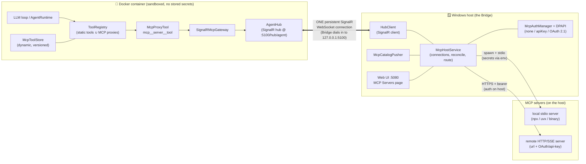
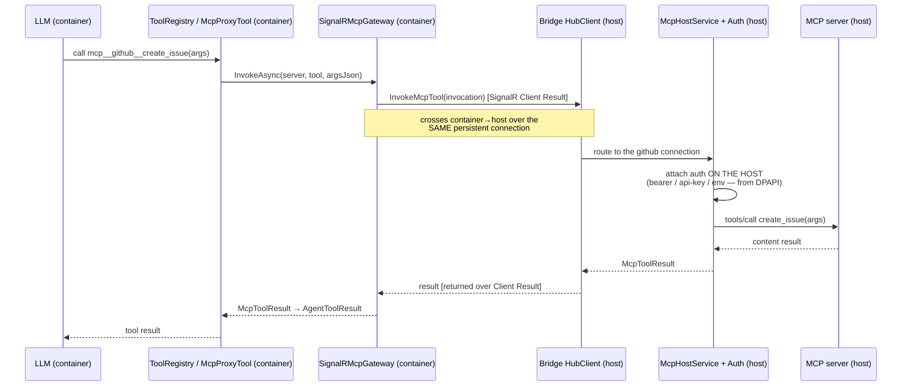

# MCP Plugin System

How the Cortex agent uses arbitrary third-party **MCP (Model Context Protocol)** servers —
local `stdio` and remote `HTTP` — as if their tools were native agent tools, with **all server
processes and authentication running on the host (the Bridge)** and the **agent (in Docker)
staying credential-free**.

- Spec: [`docs/superpowers/specs/2026-06-28-host-mcp-plugin-system-design.md`](superpowers/specs/2026-06-28-host-mcp-plugin-system-design.md)
- Shipped: v0.2.289

## The one principle: the Bridge is the MCP host *and* the credential boundary

The agent never sees an MCP credential. It only ever sees tool **names + JSON schemas** and calls
them by name. The Bridge attaches the correct auth at the moment it talks to the MCP server —
entirely on the host. The agent (sandboxed in the container) is a **pure tool consumer**; the
Bridge is a **thin transport + auth proxy** that owns everything the container can't safely do:
spawning processes, network egress to MCP servers, browser-based OAuth consent, encrypted token
storage, and refresh.

> MCP servers themselves are **never** reached from inside the container. Only tool **names**,
> **arguments** (produced by the model), and **results** cross the container boundary — never a
> credential.

## Component / deployment view



Everything new for MCP rides the **existing** Bridge↔agent SignalR hub — no new container port,
no new inbound exposure.

## How a server's tools reach the agent (catalog push)

1. You add a server in the Web UI (host). The Bridge's `McpHostService` spawns the `stdio` process
   (or connects the `HTTP` client), does the MCP handshake, and `tools/list`.
2. `McpCatalogPusher` builds a namespaced `McpToolCatalog` (`mcp__<server>__<tool>` + JSON schema)
   and pushes it to the agent by **invoking the agent hub method** `IAgentHub.UpdateMcpToolCatalog`
   over the SignalR connection.
3. The agent's `AgentHub.UpdateMcpToolCatalog` hands it to `McpToolStore`, which builds one
   `McpProxyTool` per definition and bumps a version. `ToolRegistry` merges these dynamic tools
   with the static built-ins (cache keyed on a composite `(channelVersion, mcpVersion)`), so the
   new tools appear in the model's tool list **immediately, no restart**.

## How a tool call works (invocation)



The credential is applied **only** at the `McpHostService → MCP server` hop, on the host. The
container only emitted a tool name + arguments and received content back.

## How the Bridge "reaches" the agent in the container

This is the crux, and it is deliberately the *only* channel:

- The **agent hosts the SignalR hub** (`AgentHub`) at `…/hub/agent` on container port **5100**,
  which Docker publishes to the host loopback **`127.0.0.1:5100`**.
- The **Bridge is the SignalR client**. On startup it *dials in* to
  `http://127.0.0.1:5100/hub/agent` (the `agentHubUrl`) and authenticates with the shared
  `CORTEX_HUB_TOKEN`. The agent's `HubTokenAuthHandler` accepts the connection because, through
  Docker's port forwarding, it arrives as the bridge-network gateway address
  (`::ffff:172.18.0.1`) — a **non-loopback** address. (Loopback `::1` is rejected, which is why
  the URL must be `127.0.0.1`, not `localhost` — `localhost` can resolve to IPv6 `::1`.)
- That single connection is a **persistent, bidirectional WebSocket** with auto-reconnect. Both
  directions multiplex over it:
  - **Bridge → Agent** = invoking **hub** methods on `IAgentHub` (e.g. `UpdateMcpToolCatalog`,
    `SendMessage`, `UpdateConfig`).
  - **Agent → Bridge** = the hub invoking **client** methods on `IAgentHubClient` (e.g.
    `InvokeMcpTool`, `OnProactiveMessage`), using **SignalR Client Results** so a call like
    `InvokeMcpTool` can return an `McpToolResult` synchronously to the caller.

So the MCP system adds **no new network path** to the container. The container stays sandboxed
(it exposes only the hub port and holds no secrets); the Bridge reaches in over the one
authenticated hub, and the MCP catalog and every tool invocation are just additional message types
multiplexed on that existing connection. The MCP servers live entirely on the host side of that
boundary.

## Auth (configurable per server; HTTP auto-discovers, stdio is manual)

| Mode | stdio | HTTP |
|------|-------|------|
| `none` | nothing attached | nothing attached |
| `apiKey` | secret injected as an **env var** (from DPAPI, by `secretRef`) | `Authorization: Bearer` (or a custom header) |
| `oauth` / `auto` | n/a (stdio servers do their *own* browser OAuth on the host if needed) | full **OAuth 2.1**: `401`→`WWW-Authenticate`→protected-resource metadata→AS metadata→**Dynamic Client Registration**→**PKCE S256** via the system browser→loopback callback `GET /mcp/oauth/callback` on `:5080`→tokens in **DPAPI**→auto-refresh + 401-retry |

- **Why stdio is manual:** the stdio MCP protocol carries no auth, so a server can't advertise what
  it needs — you provide its env/secrets at add-time (same as every MCP client). A **Test connect**
  surfaces the server's own stderr (which usually says what's missing).
- **Why HTTP auto-discovers:** the MCP Authorization spec makes the server *tell* the Bridge what it
  needs via the `401`→metadata handshake, so you typically just add a URL and click **Connect**.
- **Encryption at rest:** all secrets/tokens live only in **DPAPI** (`SecretManager`); `cortex.yml`
  holds only `secretRef` ids and `${secret:id}` tokens — never a value.

## Configuration

Per-tenant, under `mcp` / `mcpServers` in `cortex.yml` (non-secret only):

```yaml
mcp:
  enabled: true            # master kill-switch (default true)
mcpServers:
  - key: github            # unique; tool prefix mcp__github__*
    enabled: true
    transport: http
    url: https://api.githubcopilot.com/mcp/
    auth: auto             # auto | none | apiKey | oauth
    secretRef: mcp/github/apikey      # DPAPI id; value never in YAML
    toolAllowList: [create_issue, list_prs]   # empty = all
  - key: filesystem
    transport: stdio
    command: npx
    args: ["-y", "@modelcontextprotocol/server-filesystem", "/app/shared"]
    auth: none
```

Manage it all in **Web UI `:5080` → Global Settings → MCP Servers**: add/edit/delete, live enable
toggles + master switch, write-only secret fields, OAuth **Connect**, **Test**/**Reconnect**, and a
per-tool allow-list.

## Security model

- **Agent never holds a credential** — secrets stay on the host, applied only at the host↔server hop.
- **stdio processes spawn with a minimal environment** (`InheritEnvironmentVariables = false`) so a
  third-party server can't read the Bridge's env (e.g. `CORTEX_HUB_TOKEN`).
- **No cleartext credentials:** api-key/OAuth bearer is refused over plaintext `http://` to a
  non-loopback host; OAuth discovery/token/authorization endpoints must be `https` (or loopback) —
  blocking SSRF, secret exfiltration, and `file://`-via-`ShellExecute` abuse.
- **The tool allow-list is a real boundary** — enforced at *invoke* time, not just hidden from the
  catalog, so a prompt-injected agent can't call an excluded tool by naming it.
- **Master `mcp.enabled` + per-server toggles** instantly drop tools live (no restart).
- Secrets are never logged or returned in API responses (redacted projections + sanitized errors).

## Approval-gated mutations, invocation identity, and reliability guarantees

*Status: implemented (ICM reliability foundation, Tasks 1-11).* Every MCP tool call — read or
mutation — now carries a stable identity end-to-end and resolves to one of four explicit
outcomes. Tools an administrator has classified as mutating never dispatch to the remote server
until a human approves the *exact* arguments the agent proposed.

### Invocation identity and explicit outcomes

Each Agent→Bridge dispatch gets one `InvocationId` (`Guid.CreateVersion7`), threaded through the
gateway, the tracker, the MCP call, and (for mutations) the action ledger. Every call resolves to:

| Outcome | Meaning |
|---|---|
| `Succeeded` | The MCP server returned a non-error result. |
| `Failed` | Definitive failure that never reached the server (policy/allow-list refusal, argument validation, server unavailable) or a JSON-RPC error response (server rejected the call before the tool ran). |
| `Cancelled` | Cancelled before dispatch — nothing left the Bridge. |
| `OutcomeUnknown` | The request left the Bridge and may have executed: a configured call timeout, a caller cancellation *after* dispatch started, or a transport/connection failure mid-call. |

**`OutcomeUnknown` is never automatically retried.** The agent-visible error explicitly says not
to repeat a potentially mutating call — inspect `mcp_action_status` or read back remote state
instead. A transport failure also tears the connection down (`McpServerConnectionBase` clears its
client/tools and moves to `Error`); the host drops the dead tools from the catalog immediately and
periodic reconciliation reconnects later, but the *original* invocation is never replayed.

True exactly-once remote effects still depend on the target MCP server / API being idempotent —
Cortex's guarantee is that it never *knowingly* redispatches an ambiguous call, not that the
provider itself dedupes a retry a human decides to issue by hand.

### Mutation classification is administrator-configured, never inferred

Each server in `mcpServers` carries an explicit `mutationToolAllowList` (alongside the existing
`toolAllowList`), configured the same way as the allow-list — never inferred from tool names or
the MCP server's own (untrusted) annotations:

```yaml
mcpServers:
  - key: agency-icm
    transport: stdio
    command: agency
    args: [mcp, icm]
    toolAllowList: [search_incidents, get_incident, post_discussion_entry, mitigate_incident]
    mutationToolAllowList: [post_discussion_entry, mitigate_incident]
```

- A tool in `mutationToolAllowList` is classified `RequiresApproval = true` in the catalog the
  agent sees, and classification is **rechecked immediately before dispatch** — never trusted from
  what the agent was shown earlier.
- The direct (unapproved) invocation path refuses a mutation-classified tool outright with a
  `Policy` failure; the only caller allowed to bypass that refusal is the outbox dispatcher acting
  on a human-approved action.
- When `toolAllowList` is non-empty, every mutation tool must also appear there.

### Canonical arguments and exact-hash approval

`McpCanonicalArguments.Canonicalize` turns the agent's arguments JSON into a deterministic form
before anything is persisted or approved: object keys sorted (`StringComparer.Ordinal`) at every
depth, duplicate keys rejected, array order preserved, numeric *lexical* form preserved (`1` and
`1.0` are different approvals), input capped at 256 KiB. The canonical bytes are hashed with
SHA-256 (`sha256:<lowercase hex>`).

Calling a mutation tool never dispatches it — it canonicalizes the arguments, persists a
`Proposed` action, and returns `AwaitingApproval` tool content (actionId + argumentsHash +
instruction not to repeat the call). A human then approves/rejects/cancels through the REST API
below, **passing the current `argumentsHash`**; a stale hash returns `409` and mutates nothing —
so an approval can never be silently redirected to different arguments than the ones reviewed.

### The encrypted action ledger (outbox) and its lifecycle

```
proposed -> approved | rejected | cancelled | expired
approved -> dispatching | cancelled | expired
dispatching -> succeeded | failed | outcome_unknown
dispatching -> approved   (only when dispatch is positively known not to have started)
outcome_unknown -> reconciled_succeeded | reconciled_failed
```

All other states are terminal — a terminal action **never dispatches again**. State, decisions,
attempts, and events are persisted to a Bridge-local, encrypted SQLite database at
`%LOCALAPPDATA%\Cortex\mcp\actions.db`, keyed the same way as the rest of the Bridge's encrypted
storage (`SecretManager.GetOrCreateDatabaseKey()`). On Bridge startup, any action still
`Dispatching` — meaning the previous process died mid-dispatch — is recovered as
`OutcomeUnknown`, exactly as ambiguous as a live timeout, and is **never blindly redispatched**.

### Mutation action REST API

Authenticated routes (`RequireAuthorization()`), mapped next to the existing MCP config API:

| Method | Path | Description |
|---|---|---|
| GET | `/api/mcp/actions` | List actions (filter by `serverKey`, `toolName`, `state`, `workerId`, paged with `before`/`limit`). |
| GET | `/api/mcp/actions/{actionId}` | One action, including its canonical arguments (for review) and result. |
| POST | `/api/mcp/actions/{actionId}/approve` | Body `{ argumentsHash, reason?, expiresAtUtc? }` (default TTL 1h). |
| POST | `/api/mcp/actions/{actionId}/reject` | Body `{ argumentsHash, reason? }`. |
| POST | `/api/mcp/actions/{actionId}/cancel` | Body `{ argumentsHash }`. Routes through `McpActionService` so cancelling a `Dispatching` action also signals the live invocation. |
| POST | `/api/mcp/actions/{actionId}/reconcile` | Body `{ argumentsHash, outcome: "succeeded"\|"failed", evidence, remoteReference? }`. Only accepted from `outcome_unknown`. |

HTTP semantics: `400` malformed input, `404` absent action, `409` stale `argumentsHash` or invalid
state transition, `410` expired.

### Agent-side action tools

Two native tools let the agent (not just an operator) follow up on a proposal:

- `mcp_action_status(action_id)` — look up the current state of an approval-gated action.
- `mcp_action_cancel(action_id, arguments_hash)` — cancel a proposed/approved action, or request
  cancellation of a `Dispatching` one. Cancellation after remote dispatch has actually begun
  resolves to `OutcomeUnknown`, never `Cancelled` — the agent cannot make an ambiguous mutation
  retroactively safe by asking to cancel it.

### Redaction of MCP payloads

MCP arguments and results never reach normal logs or tool telemetry, on either side of the
boundary:

- **Agent side**: `McpTelemetrySanitizer` replaces both the input and output of any `mcp__*` tool
  call with a fixed `[redacted MCP payload]` placeholder before it reaches logs, the
  `ToolExecutionMessage` streamed to the Bridge, and the persisted tool-call summary. The LLM
  itself still receives the real result over the normal tool-result message — this redaction is
  telemetry-only, never functional.
- **Bridge side**: every MCP-related log line carries only invocation id, server, tool, outcome,
  failure kind, duration, and exception **type** — never a raw argument, a raw result, or a raw
  exception message (an MCP process's own stderr/exception text is untrusted and may embed
  fragments of the payload or connection details). The same rule applies to the admin-facing
  `LastError` surfaced on the MCP Servers page.
- The generic operations endpoints (below) omit canonical arguments and result content entirely;
  exact arguments are visible only from the authenticated `GET /api/mcp/actions/{id}`.

### Per-server bounds

Each server also carries `callTimeoutSeconds` (default 45, valid range 1-59 — deliberately kept
below the Agent-side gateway ceiling so the Bridge's own timeout fires first) and `maxResultBytes`
(default 50 KiB). A result is flattened incrementally and truncated with a deterministic marker
before it crosses SignalR; a call that exceeds its timeout resolves to `OutcomeUnknown`, not a
silent partial result.

### Generic operational observability

Two read-only, authenticated endpoints expose pool-wide state without any prompt, message, result,
argument, or eval content — see [`docs/api-reference.md`](api-reference.md) for full shapes:

- `GET /api/tenants/{tenantId}/operations/subagents` — live subagent worker-pool snapshot (returns
  `503` while the agent is disconnected).
- `GET /api/operations/mcp-actions` — MCP action history, Bridge-local so it stays available while
  the agent is disconnected.

`/health` additionally carries an optional aggregate `mcpActions` block and (when the agent is
reachable) `metrics.subagents` — both degrade to `null` plus a logged warning on any failure; a
metrics probe failing never makes `/health` itself report unhealthy.

### Concurrency: a safety ceiling, not a capacity guarantee

`MaxConcurrentSubagents` is configurable **1-50** (`SubagentConcurrencyLimits`), rejected (not
clamped) outside that range by the Agent Host registry, `POST /api/settings`, and both
`AgentConfig`/`BridgeConfig` validation. Fifty is a **safety ceiling** the admission path will
never exceed — it is *not* a claim that the configured LLM/MCP providers can actually sustain 50
simultaneous workers. Provider rate limits, token cost, and MCP server capacity are explicitly
deferred (see the follow-up list in
[`documents/cortex-icm-orchestrator-proposal.md`](../documents/cortex-icm-orchestrator-proposal.md)).

### Subagent durability

Subagent task state, run mode (new vs. resume), and completion-notification delivery survive an
Agent Host restart. Recovered work is requeued but does not execute until the Bridge connection,
pushed credentials, and the MCP tool catalog are all ready again — so a crash-and-restart never
races a subagent against a container that has no MCP tools yet. Completion delivery is
**at-least-once**: a notification is claimed, delivered, and only then marked delivered; if
delivery is interrupted (crash, disconnect, LLM error) it is released and redelivered later. A
replayed completion notification is possible and is **idempotently acknowledged** by the owning
conversation turn, never applied twice.

### No coda changes

None of the above touches the bespoke Coda coding engine — its own MCP lifecycle (used for coding
sessions) is unaffected. This reliability work is scoped entirely to the native Cortex agent/MCP
plugin path described in this document.

## Scope (v1)

Tools only (MCP *resources*/*prompts* deferred). Per-tenant config. The bespoke **Coda** coding
engine is intentionally *not* an MCP server — its streaming/steering/permission semantics don't map
to MCP's request/response model.

**Coda is single-provider.** Coda connects to exactly one LLM provider, so the Bridge no longer
resolves or passes a provider/model when it launches a coding session — the former `--provider`
argument and the `Coding:Coda:Provider` / `Coding:Coda:Model` settings (and their Settings→Coding
provider/model picker) are gone. Coda self-resolves its single connected provider from its own
configuration. Which coda *binary* the Bridge launches is controlled by **`Coding:Coda:Source`**
(`Auto` | `Host` | `Bundled`, default `Auto`): `Auto` prefers the bundled `coda/coda.exe` next to
the Bridge and falls back to a host `coda` on `PATH`; `Host` always uses the host `coda`; `Bundled`
uses the bundled binary, falling back to a host `coda` (with a warning) only if it is missing. The
setting is runtime-mutable from **Settings → Coding** (or via
`GET` / `PUT /api/coding/coda-source`), which also surfaces the resolved binary path, its detected
`--version`, and whether a bundled coda is present.
