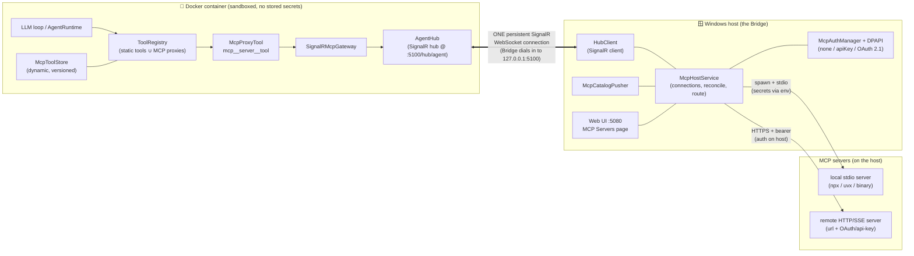
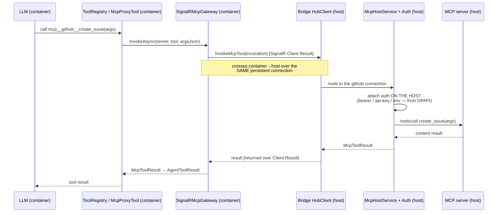

# MCP Plugin System

How the Cortex agent uses arbitrary third-party **MCP (Model Context Protocol)** servers —
local `stdio` and remote `HTTP` — as if their tools were native agent tools, with **all server
processes and authentication running on the host (the Bridge)** and the **agent (in Docker)
staying credential-free**.

- Spec: [`docs/superpowers/specs/2026-06-28-host-mcp-plugin-system-design.md`](superpowers/specs/2026-06-28-host-mcp-plugin-system-design.md)
- Shipped: v0.2.289

## The one principle: the Bridge is the MCP host *and* the credential boundary

The agent never sees an MCP credential. It only ever sees tool **names + JSON schemas** and calls
them by name. The Bridge attaches the correct auth at the moment it talks to the MCP server —
entirely on the host. The agent (sandboxed in the container) is a **pure tool consumer**; the
Bridge is a **thin transport + auth proxy** that owns everything the container can't safely do:
spawning processes, network egress to MCP servers, browser-based OAuth consent, encrypted token
storage, and refresh.

> MCP servers themselves are **never** reached from inside the container. Only tool **names**,
> **arguments** (produced by the model), and **results** cross the container boundary — never a
> credential.

## Component / deployment view



Everything new for MCP rides the **existing** Bridge↔agent SignalR hub — no new container port,
no new inbound exposure.

## How a server's tools reach the agent (catalog push)

1. You add a server in the Web UI (host). The Bridge's `McpHostService` spawns the `stdio` process
   (or connects the `HTTP` client), does the MCP handshake, and `tools/list`.
2. `McpCatalogPusher` builds a namespaced `McpToolCatalog` (`mcp__<server>__<tool>` + JSON schema)
   and pushes it to the agent by **invoking the agent hub method** `IAgentHub.UpdateMcpToolCatalog`
   over the SignalR connection.
3. The agent's `AgentHub.UpdateMcpToolCatalog` hands it to `McpToolStore`, which builds one
   `McpProxyTool` per definition and bumps a version. `ToolRegistry` merges these dynamic tools
   with the static built-ins (cache keyed on a composite `(channelVersion, mcpVersion)`), so the
   new tools appear in the model's tool list **immediately, no restart**.

## How a tool call works (invocation)



The credential is applied **only** at the `McpHostService → MCP server` hop, on the host. The
container only emitted a tool name + arguments and received content back.

## How the Bridge "reaches" the agent in the container

This is the crux, and it is deliberately the *only* channel:

- The **agent hosts the SignalR hub** (`AgentHub`) at `…/hub/agent` on container port **5100**,
  which Docker publishes to the host loopback **`127.0.0.1:5100`**.
- The **Bridge is the SignalR client**. On startup it *dials in* to
  `http://127.0.0.1:5100/hub/agent` (the `agentHubUrl`) and authenticates with the shared
  `CORTEX_HUB_TOKEN`. The agent's `HubTokenAuthHandler` accepts the connection because, through
  Docker's port forwarding, it arrives as the bridge-network gateway address
  (`::ffff:172.18.0.1`) — a **non-loopback** address. (Loopback `::1` is rejected, which is why
  the URL must be `127.0.0.1`, not `localhost` — `localhost` can resolve to IPv6 `::1`.)
- That single connection is a **persistent, bidirectional WebSocket** with auto-reconnect. Both
  directions multiplex over it:
  - **Bridge → Agent** = invoking **hub** methods on `IAgentHub` (e.g. `UpdateMcpToolCatalog`,
    `SendMessage`, `UpdateConfig`).
  - **Agent → Bridge** = the hub invoking **client** methods on `IAgentHubClient` (e.g.
    `InvokeMcpTool`, `OnProactiveMessage`), using **SignalR Client Results** so a call like
    `InvokeMcpTool` can return an `McpToolResult` synchronously to the caller.

So the MCP system adds **no new network path** to the container. The container stays sandboxed
(it exposes only the hub port and holds no secrets); the Bridge reaches in over the one
authenticated hub, and the MCP catalog and every tool invocation are just additional message types
multiplexed on that existing connection. The MCP servers live entirely on the host side of that
boundary.

## Auth (configurable per server; HTTP auto-discovers, stdio is manual)

| Mode | stdio | HTTP |
|------|-------|------|
| `none` | nothing attached | nothing attached |
| `apiKey` | secret injected as an **env var** (from DPAPI, by `secretRef`) | `Authorization: Bearer` (or a custom header) |
| `oauth` / `auto` | n/a (stdio servers do their *own* browser OAuth on the host if needed) | full **OAuth 2.1**: `401`→`WWW-Authenticate`→protected-resource metadata→AS metadata→**Dynamic Client Registration**→**PKCE S256** via the system browser→loopback callback `GET /mcp/oauth/callback` on `:5080`→tokens in **DPAPI**→auto-refresh + 401-retry |

- **Why stdio is manual:** the stdio MCP protocol carries no auth, so a server can't advertise what
  it needs — you provide its env/secrets at add-time (same as every MCP client). A **Test connect**
  surfaces the server's own stderr (which usually says what's missing).
- **Why HTTP auto-discovers:** the MCP Authorization spec makes the server *tell* the Bridge what it
  needs via the `401`→metadata handshake, so you typically just add a URL and click **Connect**.
- **Encryption at rest:** all secrets/tokens live only in **DPAPI** (`SecretManager`); `cortex.yml`
  holds only `secretRef` ids and `${secret:id}` tokens — never a value.

## Configuration

Per-tenant, under `mcp` / `mcpServers` in `cortex.yml` (non-secret only):

```yaml
mcp:
  enabled: true            # master kill-switch (default true)
mcpServers:
  - key: github            # unique; tool prefix mcp__github__*
    enabled: true
    transport: http
    url: https://api.githubcopilot.com/mcp/
    auth: auto             # auto | none | apiKey | oauth
    secretRef: mcp/github/apikey      # DPAPI id; value never in YAML
    toolAllowList: [create_issue, list_prs]   # empty = all
  - key: filesystem
    transport: stdio
    command: npx
    args: ["-y", "@modelcontextprotocol/server-filesystem", "/app/shared"]
    auth: none
```

Manage it all in **Web UI `:5080` → Global Settings → MCP Servers**: add/edit/delete, live enable
toggles + master switch, write-only secret fields, OAuth **Connect**, **Test**/**Reconnect**, and a
per-tool allow-list.

## Security model

- **Agent never holds a credential** — secrets stay on the host, applied only at the host↔server hop.
- **stdio processes spawn with a minimal environment** (`InheritEnvironmentVariables = false`) so a
  third-party server can't read the Bridge's env (e.g. `CORTEX_HUB_TOKEN`).
- **No cleartext credentials:** api-key/OAuth bearer is refused over plaintext `http://` to a
  non-loopback host; OAuth discovery/token/authorization endpoints must be `https` (or loopback) —
  blocking SSRF, secret exfiltration, and `file://`-via-`ShellExecute` abuse.
- **The tool allow-list is a real boundary** — enforced at *invoke* time, not just hidden from the
  catalog, so a prompt-injected agent can't call an excluded tool by naming it.
- **Master `mcp.enabled` + per-server toggles** instantly drop tools live (no restart).
- Secrets are never logged or returned in API responses (redacted projections + sanitized errors).

## Scope (v1)

Tools only (MCP *resources*/*prompts* deferred). Per-tenant config. The bespoke **Coda** coding
engine is intentionally *not* an MCP server — its streaming/steering/permission semantics don't map
to MCP's request/response model.
